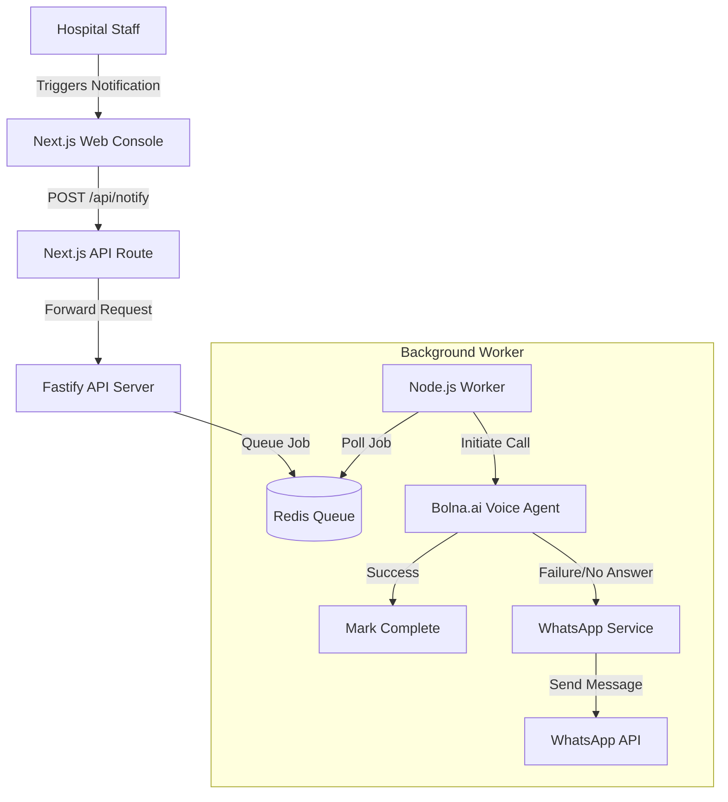

# K-Voice: Intelligent Patient Notification System

## 🏥 Business Overview (Stakeholder Perspective)

### The Challenge
Hospital staff spend valuable time manually calling patients for routine updates—informing them that lab reports are ready, verifying appointment attendance, or following up on bill payments. This manual process is:
- **Time-Consuming**: Nurses and admin staff are diverted from critical care duties.
- **Inconsistent**: Information delivery varies by staff member.
- **Unreliable**: Calls often go unanswered or are missed.

### The Solution: K-Voice
K-Voice is an **automated, AI-powered communication bridge** between your hospital management system and your patients. It acts as a 24/7 intelligent agent that handles routine outbound communication with precision and empathy.

### Key Value Propositions
1.  **Staff Efficiency**: Frees up nursing and administrative staff to focus on patient care rather than phone calls.
2.  **Standardized Communication**: Ensures every patient receives accurate, consistent information in their preferred language.
3.  **Smart Escalation**: If a voice call isn't answered or fails, the system automatically falls back to WhatsApp, ensuring the message is delivered.
4.  **Real-time Visibility**: Dashboard provides live status of all notification attempts (Queued, Calling, Success, Failed).
5.  **Multi-Language Support**: Capable of communicating in local languages (e.g., Kannada, Hindi, English) to serve diverse patient demographics.

---

## ⚙️ Technical Overview (Developer Perspective)

K-Voice is a modern, event-driven application built for reliability and scale. It decouples the user interface from the heavy lifting of voice processing using a message queue architecture.

### Architecture
The system consists of three main components:
1.  **Frontend (Web Console)**: A Next.js application for staff to trigger notifications and monitor status.
2.  **API Gateway**: A high-performance Fastify server that validates requests and manages the job queue.
3.  **Worker Service**: A background process that executes the actual calls and manages the fallback logic.



### Technology Stack
-   **Frontend**: Next.js 14, React, Tailwind CSS, Lucide Icons.
-   **Backend**: Node.js, Fastify (framework), TypeScript.
-   **Queue & State Management**: Redis, BullMQ (for robust job processing).
-   **AI Voice Provider**: Bolna.ai (Conversational AI).
-   **Communication Channels**: Voice (Primary), WhatsApp (Fallback).

### Key Features Implementation
-   **Reliable Queuing**: Uses BullMQ to ensure no notification request is lost, even during high traffic.
-   **Resilience**: The worker automatically handles retries and fallbacks.
-   **Type Safety**: End-to-end TypeScript implementation with Zod for runtime validation.
-   **Proxy Pattern**: The Next.js frontend acts as a secure proxy to the backend API, preventing CORS issues and hiding internal architecture details.

---

## 🚀 Getting Started

### Prerequisites
-   **Node.js** (v18 or higher)
-   **Redis** server running locally or accessible via URL.
-   **API Keys**: Bolna.ai (and optionally WhatsApp API).

### Installation

First, install dependencies for both services.

**1. Install Backend Dependencies:**
```bash
cd api
npm install
```

**2. Install Frontend Dependencies:**
```bash
cd ../web
npm install
```

### Running the Application (Requires 2 Terminals)

To run the full system, you need to run the backend and frontend simultaneously in separate terminal windows.

#### Terminal 1: Backend Service (API & Worker)
Open a new terminal and run:
```bash
cd api
# Ensure your .env file is configured
npm run dev
```
*This starts the API server on port 3003 and the worker process.*

#### Terminal 2: Frontend Console (Web)
Open a **second** terminal and run:
```bash
cd web
npm run dev
```
*This starts the Web UI on port 3000.*

You can now access the application at `http://localhost:3000`.

### Environment Configuration
Ensure your `.env` files are set up in both directories.

**API (`api/.env`):**
```env
PORT=3003
REDIS_URL=redis://localhost:6379
BOLNA_API_KEY=your_key_here
BOLNA_AGENT_ID=your_agent_id
# Optional for fallback
WHATSAPP_API_KEY=your_whatsapp_key
```

**Web (`web/.env.local`):**
No specific env vars required for local dev as it proxies to localhost:3003 by default.

---

## 🔮 Roadmap
-   [ ] **Two-way Sync**: Update Hospital Management System (HMS) status based on call outcome.
-   [ ] **Bulk Upload**: Trigger notifications for hundreds of patients via CSV upload.
-   [ ] **Analytics Dashboard**: Visualize success rates and call durations over time.
